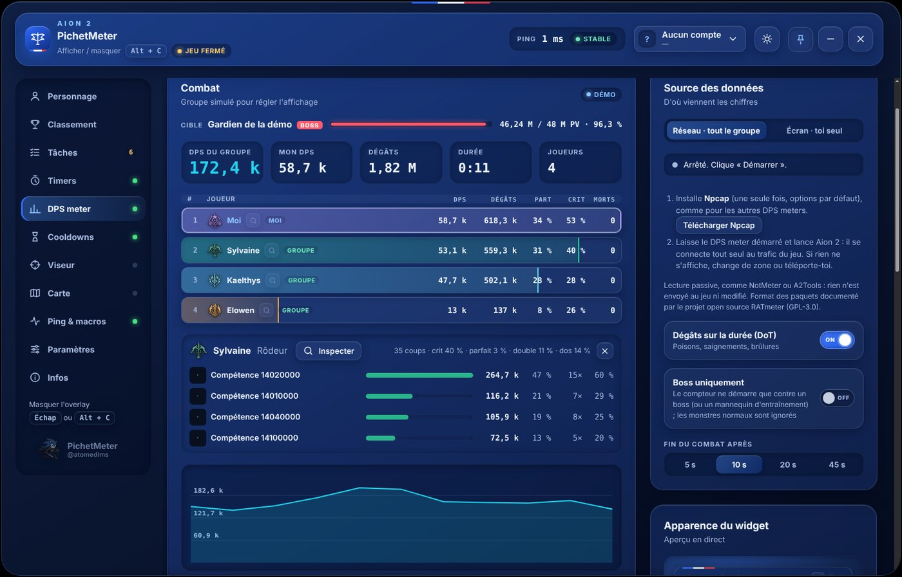
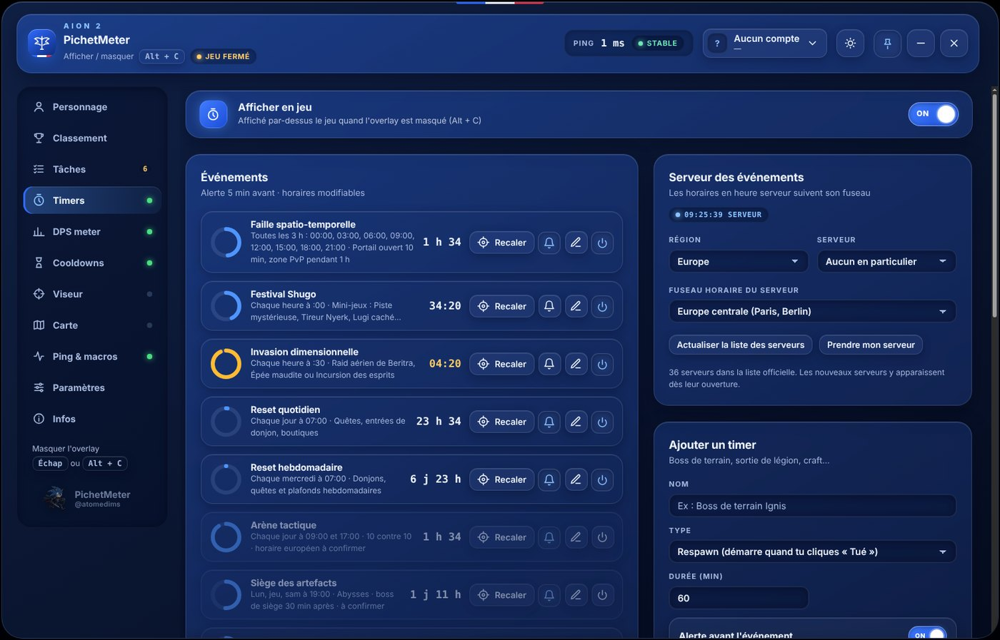
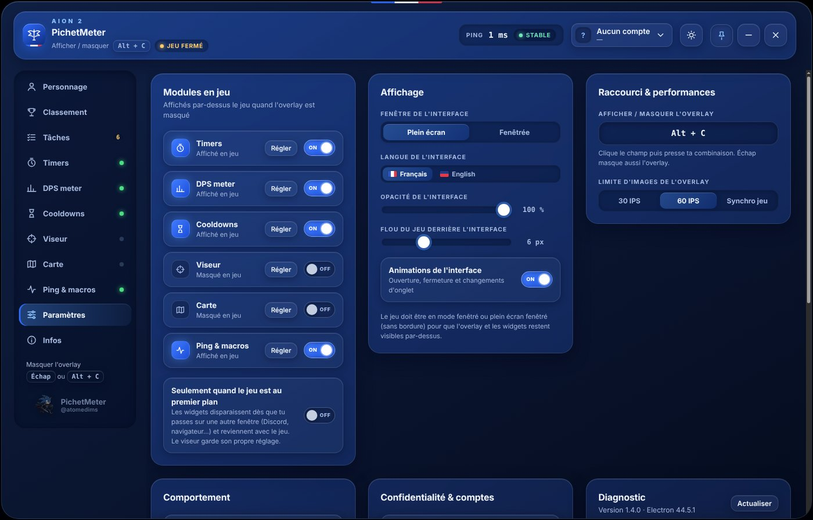

<p align="center">
  
</p>

<h1 align="center">PichetMeter</h1>

<p align="center">
  Compagnon gratuit pour <b>Aion 2</b> : DPS meter de groupe, armurerie, timers, cooldowns, macros, viseur et carte,<br>
  affichés directement par-dessus le jeu. Un raccourci (<kbd>Alt</kbd> + <kbd>C</kbd>), pas d'<kbd>Alt</kbd> + <kbd>Tab</kbd>.
</p>

<p align="center">
  <a href="https://github.com/Pichetdechiasso/PichetMeter-Aion2-Multitool/releases/latest"></a>
  
  <a href="LICENSE"></a>
  <a href="https://discord.gg/KrkJrjrDJt"></a>
</p>

<p align="center">
  <a href="https://github.com/Pichetdechiasso/PichetMeter-Aion2-Multitool/releases/latest/download/PichetMeter-Installation.zip"><b>⬇ Télécharger PichetMeter pour Windows</b></a>
  &nbsp;·&nbsp; <a href="#english">English</a>
</p>



## Fonctionnalités

| Module | Ce qu'il fait |
|---|---|
| **DPS meter de groupe** | DPS, dégâts, part, critiques, coups parfaits, attaques de dos, morts et détail des compétences de chaque joueur. Cible et PV du boss, historique des combats, option « Boss uniquement », widget transparent ou masqué hors combat. Une loupe à côté de chaque nom ouvre la fiche du joueur. |
| **Armurerie** | Recherche d'un joueur par pseudo : équipement, compétences, Daevanion, puissance de combat, classements. Favoris, plusieurs comptes. |
| **Classement** | Classements officiels, ou comparatif de tes personnages et favoris. |
| **Timers** | Événements des serveurs Europe (faille, festival, invasion, arène, siège…) en heure locale, alertes avant le début, bouton « Recaler » si un horaire change, timers personnalisés. |
| **Cooldowns** | Compte à rebours des compétences au moment où tu appuies sur leur touche, avec test de détection. |
| **Macros** | Macros clavier et souris : une fois, N fois, maintenir ou On / Off, délai en ms entre chaque action, plusieurs macros sur une même touche, sorts choisis par leur icône et menu « Sorts & touches », arrêt d'urgence. Désactivées par défaut. |
| **Auto-potions** | Appuie sur F1, F2, F3 (modifiables) quand la vie passe sous des seuils choisis, en lisant la barre de vie à l'écran. Partie du module Macros. |
| **Viseur** | Viseur personnalisable dessiné au centre de l'écran. |
| **Carte** | Carte interactive communautaire (AION2.run, Aion2 Interactive Map, Wikily…) dans l'interface ou en widget. |
| **Ping & tâches** | Latence réelle vers le serveur, liste des quotidiennes et hebdomadaires. |

Chaque module a un interrupteur **Afficher en jeu** et peut ne s'afficher que lorsque le jeu est au premier plan. Interface en français ou en anglais, thème sombre ou clair, animations désactivables.

<table>
  <tr>
    <td></td>
    <td></td>
  </tr>
</table>

## Installation

1. Télécharge **[PichetMeter-Installation.zip](https://github.com/Pichetdechiasso/PichetMeter-Aion2-Multitool/releases/latest/download/PichetMeter-Installation.zip)** (ou une version précise dans [Releases](https://github.com/Pichetdechiasso/PichetMeter-Aion2-Multitool/releases)).
2. Clic droit sur le zip > **Extraire tout…**, puis ouvre le dossier extrait.
3. Double-clique sur **Installer.cmd**.
   Si Windows affiche « Windows a protégé votre ordinateur » : l'application n'est pas signée par un éditeur payant. Clique **Informations complémentaires** puis **Exécuter quand même**.
4. La première fois, l'installation télécharge le moteur [Electron](https://github.com/electron/electron) officiel (environ 150 Mo) et vérifie son empreinte SHA-256. PichetMeter est installé dans `%LOCALAPPDATA%\Programs\PichetMeter`, avec un raccourci sur le Bureau et dans le menu Démarrer. Aucun droit administrateur n'est demandé.

**Mise à jour :** relance `Installer.cmd` de la nouvelle version. Comptes et réglages sont conservés.
**Désinstallation :** Paramètres Windows > Applications installées > PichetMeter.

### Pour le DPS meter

Installe [Npcap](https://npcap.com) (options par défaut). Il permet de lire le trafic du jeu, comme les autres DPS meters.

## Utilisation

- Mets Aion 2 en **Fenêtré** ou **Plein écran fenêtré** : en plein écran exclusif, Windows n'affiche rien par-dessus le jeu.
- <kbd>Alt</kbd> + <kbd>C</kbd> affiche ou masque l'interface (modifiable). <kbd>Échap</kbd> la masque aussi.
- Interface masquée : les modules réglés sur **Afficher en jeu** restent à l'écran. Taille, opacité, position et clic à travers se règlent dans chaque onglet.
- Un souci ? **Paramètres > Diagnostic** indique l'état de chaque module. Le journal et les réglages sont dans `%APPDATA%\PichetMeter`.

Le fichier [LISEZ-MOI.txt](LISEZ-MOI.txt), inclus dans le zip, détaille chaque module.

## Comment ça marche

- PichetMeter **ne modifie pas le jeu** et n'injecte rien dans son processus : il affiche ses propres fenêtres par-dessus.
- Le DPS meter **lit passivement** le trafic réseau du jeu avec Npcap, sans rien envoyer. Le décodage des paquets s'appuie sur le travail du projet open source [RATmeter](https://github.com/Kuroukihime/AIon2-Dps-Meter).
- La détection des cooldowns écoute **uniquement les touches que tu as choisies**, sans jamais les bloquer ni en envoyer.
- Le module **Macros** est le seul à agir sur le jeu : désactivé par défaut, il envoie des appuis de touches et des clics simulés (SendInput) quand tu le déclenches, uniquement jeu au premier plan, jamais interface ouverte, avec une touche d'arrêt d'urgence. Les auto-potions lisent seulement la couleur de la barre de vie à l'écran, rien dans le jeu.
- Si Aion 2 tourne en administrateur, Windows bloque les macros et la lecture du clavier en jeu : PichetMeter le détecte et propose de se relancer en administrateur.
- **Aucune donnée n'est collectée.** Tout reste sur ton PC. Connexions : services officiels de NCSOFT (fiches, classements), la carte communautaire choisie, Google Fonts, et GitHub pendant l'installation.

> [!WARNING]
> PichetMeter est un outil communautaire **non officiel**, ni développé ni approuvé par NCSOFT. Les règles de l'éditeur sur les outils tiers peuvent évoluer, et l'automatisation des actions (module Macros) peut être interdite : chacun l'utilise sous sa propre responsabilité. Le logiciel est fourni « tel quel », sans garantie.

## Développement

Le code est en JavaScript (Electron) et PowerShell, sans dépendance npm.

```
app/          application Electron
  main.js       processus principal : fenêtres, widgets, raccourcis, armurerie, DPS
  ui.html       interface (une seule page, aussi utilisée par chaque widget via #w=<module>)
  reseau.js     décodage du trafic du jeu (DPS de groupe)
  macrologic.js traduction des macros en commandes pour macro.ps1
  *.ps1         modules Windows : état du jeu, touches, macros, viseur natif, capture Npcap
  i18n.js       traduction anglaise
setup/        installeur et désinstalleur Windows (Installer.cmd)
test/         tests Node (node test/xxx.test.js)
tools/        build.py (paquet d'installation), pscheck.ps1 (vérification PowerShell)
```

- **Lancer depuis les sources :** `npx electron@44.5.1 app`. Sous Windows, tout fonctionne ; ailleurs, l'interface tourne avec des données d'exemple.
- **Installer depuis les sources :** `setup\Installer.cmd` fonctionne aussi depuis le dépôt téléchargé.
- **Tests :** `for t in test/*.test.js; do node "$t"; done`, et `pwsh tools/pscheck.ps1 -Files app/*.ps1` pour les scripts PowerShell.
- **Paquet :** `python3 tools/build.py` produit `dist/PichetMeter-<version>-Installation.zip`.
- **Publier une version :** mets à jour la version dans `app/package.json`, `setup/fichiers/installer.ps1` (`$AppVersion`), `LISEZ-MOI.txt` et `CHANGELOG.md`, puis pousse sur `main`. GitHub Actions teste, construit le zip, crée le tag `vX.Y.Z` et la release (une seule fois par version).

Les contributions sont les bienvenues : ouvre une *issue* ou une *pull request*, ou passe sur le [Discord](https://discord.gg/KrkJrjrDJt).

## Crédits et licences

- Créé par **@atomedims** · [Discord](https://discord.gg/KrkJrjrDJt)
- Décodage réseau et table des monstres : d'après [RATmeter](https://github.com/Kuroukihime/AIon2-Dps-Meter) (GPL-3.0)
- [Electron](https://www.electronjs.org) (MIT), [rcedit](https://github.com/electron/rcedit) (MIT), polices Sora, Nunito Sans et JetBrains Mono (SIL Open Font License)
- AION et AION 2 sont des marques de NCSOFT Corporation ; icônes de classe et images du jeu © NCSOFT
- Le logo est un fan art ; Sonic the Hedgehog est une marque de SEGA, sans lien avec ce projet

PichetMeter est un logiciel libre distribué sous licence **GNU GPL version 3** ([LICENSE](LICENSE)).

---

<a id="english"></a>

## English

**PichetMeter** is a free overlay companion for **Aion 2** on Windows: party DPS meter (passive network reading through Npcap, per-player skill breakdown, boss-only mode), armory and player lookup, rankings, EU event timers, skill cooldowns, keyboard and mouse macros (off by default), crosshair, interactive map, ping and daily/weekly tasks. Everything sits on top of the game, toggled with <kbd>Alt</kbd> + <kbd>C</kbd>. The interface is available in English (Settings > Display > Language).

**Install:** download [PichetMeter-Installation.zip](https://github.com/Pichetdechiasso/PichetMeter-Aion2-Multitool/releases/latest/download/PichetMeter-Installation.zip), extract it, run `Installer.cmd`. The first install downloads the official Electron runtime (~150 MB) and verifies its SHA-256. No admin rights needed. For the DPS meter, install [Npcap](https://npcap.com). Run the game in windowed or borderless mode.

PichetMeter does not modify or inject into the game and collects no data. Only the optional Macros module sends simulated input to the game when you trigger it; automating actions may be against the game rules. It is an unofficial community tool, not affiliated with or endorsed by NCSOFT. Use it at your own risk. Licensed under GPL-3.0.
